# reps.io

PWA para seguimiento de entrenamientos de gimnasio. Permite crear programas de entrenamiento, registrar sesiones, editar series en tiempo real y ver el progreso con gráficos.

## Flujo de pantallas



## Stack

| Capa | Tecnología |
|---|---|
| Frontend | React 19 + Vite |
| Animaciones | Framer Motion (motion/react) |
| Gráficos | Recharts 3.x |
| Routing | React Router 7 |
| Drag & Drop | dnd-kit |
| Backend / DB | Firebase Firestore |
| Auth | Firebase Auth |
| PWA | vite-plugin-pwa + Workbox |

## Características

- **Programas**: crear y organizar días de entrenamiento con ejercicios configurables (series, reps, notas)
- **Catálogo de ejercicios**: picker con búsqueda fuzzy sobre el catálogo global, normalización de nombres y soporte para ejercicios personalizados
- **Sesión activa**: registrar series en tiempo real con referencia al último peso/reps usado
- **Historial cruzado**: última vez, PR y progreso de un ejercicio se calculan por `catalogoId`, cruzando días distintos que comparten el mismo ejercicio
- **Timer**: cronómetro configurable con presets guardados por usuario (máx. 5) y wake lock para mantener la pantalla activa
- **Resumen de sesión**: editar series completadas; los cambios se propagan al historial
- **Progreso**: gráficos de progresión por ejercicio, volumen por sesión y peso corporal
- **Calendario**: visualización de días entrenados por mes con contador de sesiones
- **Onboarding**: flujo de primera vez para nuevos usuarios
- **Pull-to-refresh**: recarga de datos en mobile
- **Responsive**: layout de dos columnas en desktop

## Instalación

```bash
npm install
```

Crear `.env` con las credenciales de Firebase:

```
VITE_API_KEY=...
VITE_AUTH_DOMAIN=...
VITE_PROJECT_ID=...
VITE_STORAGE_BUCKET=...
VITE_MESSAGING_SENDER_ID=...
VITE_APP_ID=...
```

```bash
npm run dev      # desarrollo
npm run build    # producción
npm run preview  # preview del build
```

## Estructura de Firestore

```
usuarios/{uid}
  nombre, email, photoURL

programas/{id}
  usuarioId, nombre, orden
  eliminadoEn               ← transitorio: soft-delete con undo (toast)

dias/{id}
  programaId, usuarioId, nombre, orden
  eliminadoEn               ← transitorio (ídem programas)

ejerciciosDia/{id}
  diaId, usuarioId, nombre, grupoMuscular, esCustom, catalogoId
  seriesEsperadas, repsEsperadas, orden
  eliminadoEn               ← transitorio (ídem programas)

ejerciciosCatalogo/{id}      ← catálogo global (búsqueda fuzzy en el picker)
  nombre, grupoMuscular

sesiones/{id}
  usuarioId, diaId, fecha, nota, completada
  resumen: {                 ← denormalizado al completar
    diaNombre, volumenTotal,
    ejercicios: [{ ejercicioId, catalogoId, nombre, grupoMuscular, series: [...] }]
  }

registros/{id}
  usuarioId, sesionId, ejercicioId, nombreEjercicio, grupoMuscular, catalogoId
  numeroSerie, repsEsperadas, repsHechas, pesoUsado, nota

usuarios/{uid}/historialPeso/{id}
  peso, fecha               ← peso corporal (validado 20–300 en las reglas)

usuarios/{uid}/timerPresets/{id}
  nombre, calentamiento, trabajo, descanso, sets, enfriamiento, creadoEn
```

Las reglas (`firestore.rules`) validan la propiedad por `usuarioId`, los campos permitidos en cada `create` (`hasOnly`) y los campos que cada `update` puede tocar (`diff().affectedKeys()`).

## Optimización de lecturas (Firestore Spark)

El plan gratuito tiene 50k lecturas/día. La arquitectura usa **denormalización**: al completar una sesión se escribe un campo `resumen` con todos los datos de esa sesión. Esto permite:

- Cargar el historial completo con **una sola query** (`getSesionesConResumen`)
- Derivar todos los gráficos de Progreso **en el cliente**, sin queries adicionales
- Lookup de "última vez" para cada ejercicio **en el cliente** (`getUltimaVezEjercicioLocal`)

**Costo por usuario activo:**

| Escenario | Lecturas/día |
|---|---|
| Sin denormalización | ~3.000 |
| Con denormalización | ~70 |
| Capacidad Spark (50k) | ~700 workouts → ~350 usuarios activos |

Las sesiones antiguas (sin `resumen`) se ignoran en los gráficos. El fallback a queries individuales solo ocurre si se necesita explícitamente.

## Testing

**283 tests** — unitarios, de componentes y de páginas, en 31 archivos colocados junto al código.

```bash
npm run test        # modo watch (re-corre al guardar)
npm run test:run    # una sola pasada (para antes de hacer push)
npm run lint        # ESLint (también corre en CI)
```

### Cobertura

| Área | Tests |
|---|---|
| Capa Firebase (`sesiones` 25, `programas` 11, `registros` 10, `ejerciciosDia` 8, `dias` 7, `auth` 6, `timerPresets` 5, `peso` 4) | 76 |
| Timer (`useTimer` 15, `TimerActivo` 11, `useWakeLock` 10, `TimerConfig` 7, `TimerFin` 4, página `Timer` 6) | 53 |
| Componentes (`ui` 15, `SeleccionarEjercicio` 15, `SwipeToDelete` 11, `Toast` 9, `Calendario` 9, `BottomNav` 8, `ErrorBoundary` 5) | 72 |
| Páginas (`Progreso` 16, `Home` 9, `Entrenar` 9, `Dias` 8, `Programas` 7, `EjerciciosDia` 7, `SesionActiva` 6, `Login` 6, `ResumenSesion` 2) | 70 |
| Hooks (`useKeyboardShortcut`) | 12 |

### GitHub Actions

- **Tests** (`test.yml`): lint + tests en cada push y pull request a `main`.
- **Deploy** (`deploy.yml`): en cada push a `main`, build y deploy de hosting **y reglas de Firestore**.

---

## Archivos clave

```
src/
  firebase/
    sesiones.js      — CRUD sesiones, getSesionesConResumen, esMismoEjercicio, backfillResumen
    registros.js     — CRUD registros, getUltimaVezEjercicioLocal (cruce por catalogoId)
    programas.js     — CRUD programas y días
    ejerciciosDia.js — CRUD de ejercicios dentro de un día (catalogoId, esCustom)
    catalogo.js      — catálogo global de ejercicios (ejerciciosCatalogo)
    timerPresets.js  — CRUD de presets de timer por usuario (máx. 5)
    peso.js          — registro de peso corporal
  pages/
    Home.jsx         — dashboard con calendario y accesos rápidos
    SesionActiva.jsx — registro de series en tiempo real
    ResumenSesion.jsx — resumen y edición post-sesión
    Progreso.jsx     — gráficos de progresión, volumen y peso
    Programas.jsx    — gestión de programas y días
    Timer.jsx        — pantalla de timer
  components/
    Calendario.jsx   — calendario mensual con días entrenados
    SeleccionarEjercicio.jsx — picker de ejercicios con búsqueda fuzzy
    Onboarding.jsx   — flujo de primera vez
    PullToRefresh.jsx — pull-to-refresh para mobile
    timer/
      useTimer.js      — hook de cronómetro (cuenta regresiva, wake lock)
      TimerConfig.jsx  — configuración de duración y presets
      TimerActivo.jsx  — cronómetro corriendo
      TimerFin.jsx     — pantalla de fin de timer
  hooks/
    useDesktop.js    — detección de viewport desktop
```
